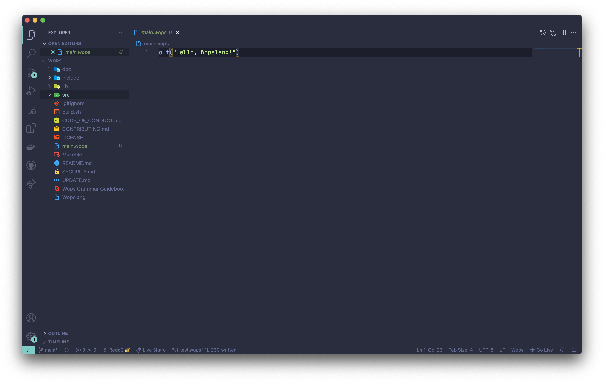

# Wops for Visual Studio Code

[The VS Code Wops extension](https://marketplace.visualstudio.com/items?itemName=WopsTeam.wopslang) will help you wops much easier!

## Quick Start

- **Step 1**. If you haven't done yet, install [The VS Code Wops extension](https://marketplace.visualstudio.com/items?itemName=WopsTeam.wopslang)
- **Step 2**. Open any `.wops` file, and check the code highlighting

You are ready to Wops 🎉

## Screenshot

